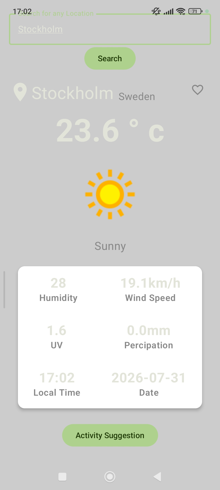
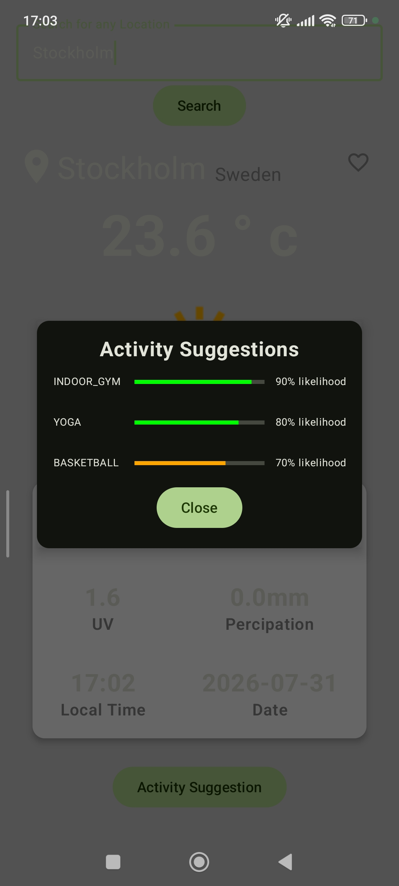
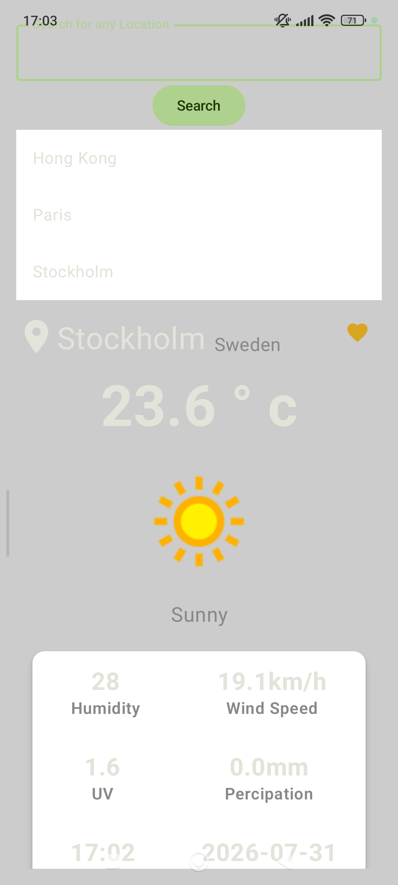

# WeatherApp

An Android weather application built with Kotlin, Jetpack Compose, Retrofit, and WeatherAPI.com.

This project was developed in Q1 2024 as part of an Android course.

## Screenshots

### Weather overview

View the current temperature, condition, location, humidity, wind speed, UV index, precipitation, local time, and date.



### Activity suggestions

Get weather-based activity recommendations with likelihood indicators. Suggestions are calculated from the current temperature, humidity, wind speed, precipitation, UV index, season, and local time, so the displayed activities change with the weather. The app currently supports:

- Football
- Swimming
- Running
- Cycling
- Indoor gym
- Yoga
- Basketball
- Picnic
- Walking
- Hiking
- Golf
- Fishing



### Location search and favorites

Search for locations and mark a location as a favorite for quick access.



## Requirements

- Android Studio Koala or newer
- JDK 11 or newer
- A WeatherAPI.com API key

## Configure the API key

The API key is intentionally not stored in the repository. Add it to your user-level Gradle properties file:

- Windows: `%USERPROFILE%\\.gradle\\gradle.properties`
- macOS/Linux: `~/.gradle/gradle.properties`

Add this line, replacing the placeholder with your own key:

```properties
WEATHER_API_KEY=your_weatherapi_key_here
```

Alternatively, pass `-PWEATHER_API_KEY=your_weatherapi_key_here` to a Gradle command.

> Important: API keys included in a client Android application can be extracted from the APK. Restrict the key in the WeatherAPI.com dashboard and monitor usage. For production applications, proxy requests through a backend you control.

## Build and run

1. Open the project in Android Studio.
2. Configure `WEATHER_API_KEY` as described above.
3. Sync Gradle and run the `app` configuration on an emulator or device.

From a terminal, the debug APK can be built with:

```text
./gradlew assembleDebug
```

On Windows, use `gradlew.bat assembleDebug`.

## Project structure

- `app/src/main/java`: application, UI, view model, and Retrofit API code
- `app/src/main/res`: Android resources and launcher assets
- `gradle/libs.versions.toml`: dependency versions

## Future improvements

- Add multi-day and hourly forecasts.
- Improve activity recommendations with more detailed weather rules and user preferences.
- Add persistent favorite locations and a favorites management screen.
- Support automatic location detection with explicit user permission.
- Add temperature-unit selection, including Celsius and Fahrenheit.
- Improve accessibility, responsive layouts, and tablet support.
- Add loading, empty, offline, and API-error states with retry actions.
- Add automated unit and UI tests for weather parsing, suggestions, and search behavior.
- Move production weather requests behind a backend so the API key is not shipped in the APK.

